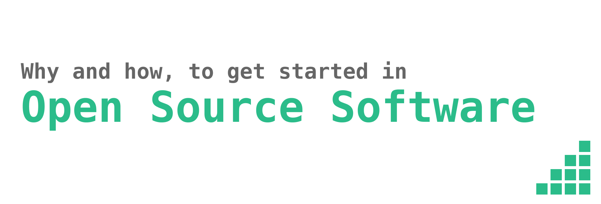

  

This project contains the notes from a workshop I am running. All contributions are welcome :heart:

### Contents
1. [What is open source software?](#what-is-open-source-software)
   * [Examples](#examples)
   * [Why are projects open source?](#why-are-projects-open-source)
2. [Why should you get started in open source?](#why-should-you-get-started-in-open-source)
   * [Learn how to contribute](#learn-how-to-contribute)
   * [Show your expertise](#show-your-expertise)
   * [Help you get hired](#help-you-get-hired)
   * [Open source internships](#open-source-internships)
3. [How to get started in open source on GitHub](#how-to-get-started-in-open-source-on-GitHub)
   * [Finding where to contribute](#finding-where-to-contribute)
   * [Forking a project](#forking-a-project)
   * [Writing a good pull request](#writing-a-good-pull-request)

# What is open source software?
_"Open Source"_ refers to something people can modify and share because its design is publicly accessible

_"Open Source Software"_ is software with source code that anyone can inspect, modify, and enhance.

### Examples
* [Node.js JavaScript runtime](https://github.com/nodejs/node)
* [Linux kernel](https://github.com/torvalds/linux)
* [Atom - The hackable text editor](https://github.com/atom/atom)
* [Ruby on Rails](https://github.com/rails/rails)
* [The MongoDB Database](https://github.com/mongodb/mongo)
* [Kickstarter's iOS app](https://github.com/kickstarter/ios-oss)

### Why are projects open source?
Projects become open source for a multitude of reasons. Here is non exhaustive list:
* **Increase Software Adoption**: Software developers can trust software that they can inspect, modify, and enhance. If a developer trusts a piece of software then they would feel more inclined to use it.  
* **Increase Software Quality**: Open source software is publicly accessible to the world and encourages collaboration. Since its publicly accessible, bug fixes and security improvements can be implemented by anyone.
* **Share Progress**: Businesses don't want to solve the same problems over and over. In the software industry, companies open source their software to make it easier for other companies to solve the same problems.

# Why should you get started in open source?
### Learn how to contribute
Contributing in open source is a great way to sharpen your skills as a developer. In the open domain you have access to all kinds of projects to hone your skills on. Specifically, as a junior developer one of the most important skills one can learn is how to contribute to a large codebase. Fortunately, there are tons of large large code bases in open source to practice on.

### Show your expertise
One way to show that you're well versed in a technology is to show that you've contributed to it. Contributing to widely adopted project can earn you the respect of your colleagues and peers. It might even make you famous.

### Help you get hired
Companies hire developers who's experience stands out. Open source contributions stand out as tangible evidence of ones expertise.

### Open source internships
As a student there are some great opportunities to get started in open source. Open source internships pay you to contribute to and maintain a project. Interns often get job opportunities following their work in open source. Here are some great internships in Open Source Software:

#### [Google Summer of Code (GSoC)](https://summerofcode.withgoogle.com/)
* For students only
* 3 months
* Work remotely
* $5500 (USD) stipend + paid trip to GSoC Summit
* Applications open January 2019

#### [Outreachy](https://www.outreachy.org): Internships Supporting Diversity in Tech
* For people who face under representation in the technology industry
* 3 months
* Work remotely
* $5500 (USD) stipend + $500 (USD) travel stipend
* Happens twice a year
  * Applications open in early February and September

#### [Rails Girls Summer of Code](https://railsgirlssummerofcode.org)
* For woman and non binary developers
* Stipend varies on location and project

# How to get started in open source on GitHub
GitHub is the largest open source community in the world. It's also the easiest place to start contributing. The following is a beginners guide on how to start contributing to open source projects.

## Finding where to contribute
Lots of open source projects can seem intimidating. Experience developers create projects that are sometimes complicated and difficult to understand. Sometimes these projects might have some low hanging fruit (easy changes to make). This low hanging fruit is usually a good place to start.

The following are some great places to find some beginner issues:
* [Up For Grabs](http://up-for-grabs.net/) - List of projects which have curated tasks specifically for new contributors.
* [issuehub.io](http://issuehub.io/) - Contribute to Open Source. Search issue labels to find the right project for you!
* [FIRST TIMERS ONLY](http://www.firsttimersonly.com/) - Friendly Open Source projects should reserve specific issues for newbies.
* [Your First PR](http://yourfirstpr.github.io/) - Your First PR helps you get started contributing to Open Source by showcasing great starter issues on GitHub and elsewhere.
* [Awesome First PR Opportunities](https://github.com/MunGell/awesome-for-beginners) - A list of awesome beginners-friendly projects.

After finding that golden issue that you hope to start working on, be sure to go and understand some of the code base first.

## Forking a project
Once you've found the project you want to contribute to you need to _fork_ it.
> A _fork_ is a copy of a repository. Forking a repository allows you to freely experiment with changes without affecting the original project.

The changes you make on your _fork_ can be used to propose changes to the _upstream_ repository.

The _upstream_ repository is the original project that you forked.

## Writing a good pull request
Writing a good pull request (PR) isn't effortless. Its all about communication. Good pull requests are code proposals that can explain the change to both maintainers and newcomers.

#### Tips for writing a strong pull request:
* Write it as a proposal
* Provide context
* Add screenshots/diagrams when possible
* Be clear and concise
* Keep diffs as small as possible

Usually, pull requests don't get approved at first glance. Maintainers will often suggest code clean up and changes. Addressing reviewers comments is only way to get your contribution merged.

#### Tips for responding to feedback
* Consider leading with an expression of appreciation, especially when feedback has been mixed.
* Ask for clarification. (“I don’t understand, can you clarify?”)
* Try to respond to every comment.
* Offer clarification, explain the decisions you made to reach a solution in question.

#### Resources for writing good pull requests:
* [How to write the perfect pull request](https://blog.github.com/2015-01-21-how-to-write-the-perfect-pull-request/) (GitHub Blog)
* [The Art of Pull Requests](https://hackernoon.com/the-art-of-pull-requests-6f0f099850f9) (Hackernoon)

# Sources
* [What is open source?](https://opensource.com/resources/what-open-source) (Opensource.com)
* [How to write the perfect pull request](https://blog.github.com/2015-01-21-how-to-write-the-perfect-pull-request/) (GitHub Blog)

